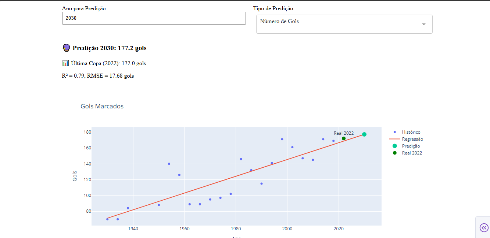
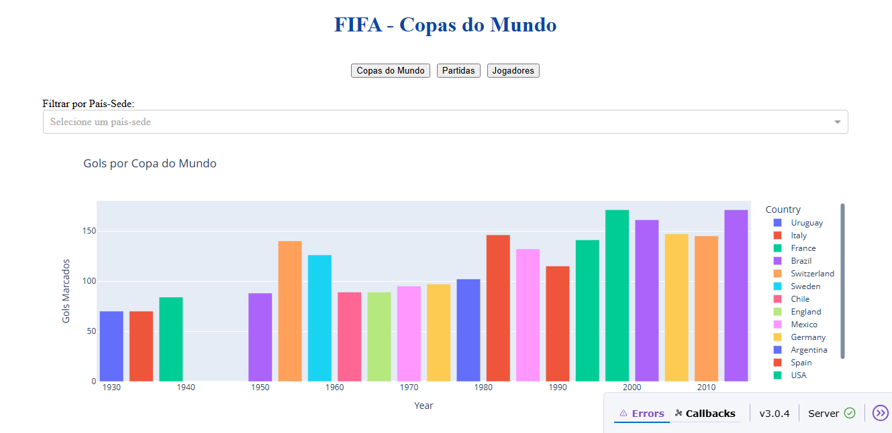
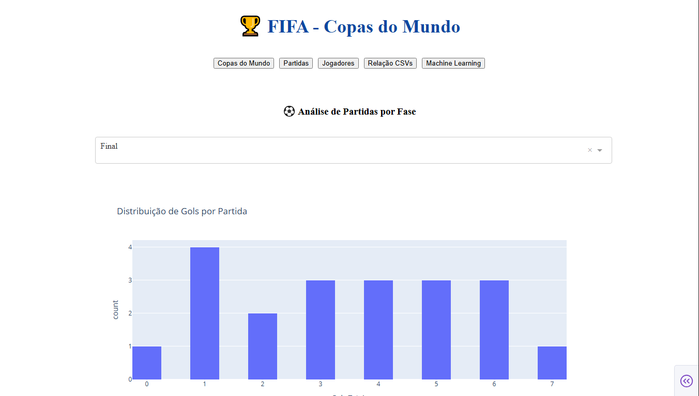

# 🏆 Análise e Visualização das Copas do Mundo de Futebol

Este projeto apresenta uma análise exploratória, visualização interativa e predição de dados históricos das Copas do Mundo de Futebol. Utilizando bibliotecas modernas de ciência de dados e dashboards web, a proposta é tornar a análise intuitiva, interativa e acessível.

---

## 📁 Estrutura do Projeto

- `data/` — arquivos CSV com dados históricos das Copas.
- `plots/` — gráficos gerados automaticamente para análise.
- `output/` — estatísticas descritivas exportadas.
- `images/` — imagens utilizadas no dashboard.
- `app.py` — inicialização da aplicação Dash com layout e rotas.
- `data_loader.py` — funções para carregar e preparar os dados.
- `visualization.py` — criação de gráficos com Plotly.
- `callbacks.py` — lógica interativa dos componentes da interface.
- `ml_model.py` — modelos de regressão e classificadores de ML.
- `README.md` — este documento.
- `requirements.txt` — bibliotecas necessárias para execução.

---

## 🌐 Acesse o Projeto

Repositório GitHub:  
[github.com/BeckerPF2021/DataScience-WordCup](https://github.com/BeckerPF2021/DataScience-WordCup)

---

## 📊 Datasets Utilizados

Fontes: FIFA e Kaggle

- `WorldCups.csv` — dados por edição (ano, país-sede, campeão, público, etc.)
- `WorldCupMatches.csv` — informações por partida (gols, fase, estádio, público)
- `WorldCupPlayers.csv` — dados dos jogadores (posição, cartões, gols, país)

### Transformações Realizadas

- Padronização de colunas e tipos de dados.
- Criação de colunas derivadas como `Total Goals`.
- Filtros dinâmicos por país, fase, time e ano.
- Exportação de estatísticas e gráficos para `.csv` e `.png`.

---

## 🧪 Tecnologias e Ferramentas

- **Dash** — construção de dashboards web.
- **Plotly** — gráficos interativos.
- **Pandas & NumPy** — análise e transformação de dados.
- **Scikit-learn** — regressão linear, Random Forest e clustering.

---

## 🤖 Modelos de Machine Learning

Implementações de:

- **Regressão Linear** — previsão de público total e gols por Copa.
- **RandomForestClassifier** — classificação de países com mais títulos.
- **KMeans** — agrupamento de jogadores por posição e desempenho.

### Resultados:

- Previsões para futuras edições.
- Métricas de desempenho: R², RMSE.
- Classificação da performance: Excelente, Boa, Regular, Baixa.
- Gráficos de tendência e comparação real x previsto.

---

## 📈 Dashboard Interativo

Dividido em 5 seções principais:

1. **Visão Geral** — títulos, gols e público por edição.
2. **Partidas** — análises por fase, sede e desempenho.
3. **Jogadores** — posição, eventos (gols, cartões) e comparativos.
4. **Correlação** — relações entre os datasets.
5. **Predições ML** — resultados dos modelos aplicados.

### Exemplos Visuais:

---

## 📬 Contato

Desenvolvido por **Guilherme Becker e Ilmar Germani**  
📧 Email: `guilhermepf97@live.com, ilmargermani94@gmail.com`  
🔗 GitHub: [github.com/BeckerPF2021](https://github.com/BeckerPF2021/DataScience-WordCup)

---

Sinta-se à vontade para clonar, contribuir ou sugerir melhorias.  
⚽📊🚀 *Ciência de dados aplicada ao esporte!*
